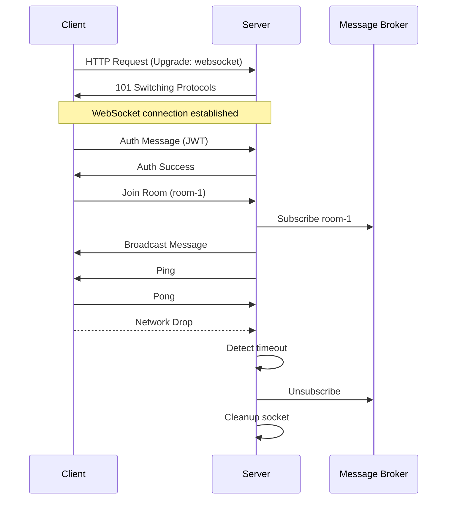

# WebSockets – Personal Revision Notes

> From fundamentals → architecture → patterns → production mindset  
> Purpose: Persistent, full-duplex communication between client and server  
> Use cases: Chat apps, live dashboards, collaborative editors, games, notifications, live trading

---

## 1. The Core Problem: Why HTTP Fails for Real-Time

HTTP is **request–response**.

That means:
- Client asks → server responds → connection closes
- Server cannot push data on its own

### Early “Real-Time” Hack: Polling
Browser keeps asking:
> “Anything changed?”

Every poll includes:
- Headers
- Cookies
- TLS overhead

Problems:
- Wasteful
- Slow
- Battery-draining (especially on mobile)

**Analogy:**  
Polling is like repeatedly asking the kitchen if your pizza is ready.

---

## 2. The Real-Time Shift: What WebSockets Solve

WebSockets introduce:
- Persistent connection
- Full-duplex communication

Once connected:
- Client and server can send data anytime
- No repeated HTTP requests
- Messages are small frames, not full HTTP payloads

Benefits:
- Lower latency
- Less network overhead
- Cheaper for servers
- Better for mobile battery

Used by:
- Chat apps
- Live comments
- Multiplayer games
- Notifications
- Live dashboards, sports feeds

---

## 3. What a WebSocket Really Is (Handshake Explained)

A WebSocket starts as HTTP.

### Handshake Flow
1. Browser sends HTTP GET request with upgrade headers
2. Server responds with **101 Switching Protocols**
3. HTTP is discarded
4. A persistent TCP tunnel remains

After upgrade:
- No request/response cycle
- Bi-directional communication
- Connection stays open

### ws vs wss
- `ws://` → unencrypted (development only)
- `wss://` → encrypted (production always)

---

## 4. Architectural Shift: Stateless → Stateful

### HTTP
- Stateless
- Server forgets client after response

### WebSockets
- Stateful
- Server keeps:
  - Socket reference
  - In-memory connection object

Enables:
- Instant server push
- Real-time broadcasting

⚠️ Statefulness introduces new risks.

---

## 5. Ghost Connections (Very Important)

If:
- User loses Wi-Fi
- Phone battery dies
- Laptop closes suddenly

Server:
- Still thinks socket is alive
- Keeps it in memory

These are **ghost connections**.

### Problems
- Memory leaks
- Fake active users
- Server slowly dies under load

---

## 6. Heartbeats: Ping / Pong

### Why Needed
- TCP does not notify silent disconnects
- Mobile networks drop silently

### How It Works
- Server sends `ping`
- Client responds with `pong`
- No pong → connection assumed dead → terminated

### Why This Is NOT Polling
- No HTTP
- No headers
- Tiny frames
- Extremely cheap

Mandatory in production.

---

## 7. WebSocket Data Types

WebSockets send messages, not pages.

### Text / JSON
Used for:
- Chat messages
- Typing indicators
- Notifications
- Commands

Pros:
- Human-readable
- Easy debugging
- Flexible

### Binary
Used for:
- Audio streaming
- Video frames
- Multiplayer game state
- High-frequency updates

Pros:
- Smaller
- Faster
- Lower latency

Real systems often use:
- JSON → control & commands
- Binary → high-speed data

---

## 8. Frames & Opcodes (Protocol Internals)

WebSocket frames include opcodes:
- Text
- Binary
- Close
- Ping
- Pong

Explains:
- Efficiency
- Clean lifecycle
- Built-in health checks

---

## 9. Backpressure (Advanced but Critical)

### Problem
Server sends faster than client can process.

Result:
- Messages queue in memory
- This is backpressure

### If Ignored
- Memory blowups
- Laggy clients
- Server crashes

### Production Handling
- Monitor buffer size
- Rate limit
- Drop or batch messages

---

## 10. Choosing Your WebSocket Weapon

### Socket.IO
- Feature-rich
- Rooms, reconnects, fallbacks
- Heavier overhead

### WebSocket as a Service (Pusher, Ably)
- Managed scaling
- Less infra work
- Cost + less control

### Native WS Library
- Minimal
- Fast
- Full control

Requires building:
- Rooms
- Heartbeats
- Reconnect logic
- Backpressure handling

---

## 11. WebSocket Lifecycle (State Machine)

| State | Meaning |
|-----|--------|
| 0 | CONNECTING |
| 1 | OPEN |
| 2 | CLOSING |
| 3 | CLOSED |

Rule:
- Send messages only when state = OPEN

---

## 12. Server-Side Events

Server handles:
- `connection`
- `message`
- `error`
- `close`

Server is authoritative.

---

## 13. Client-Side Events

Client handles:
- `open`
- `message`
- `close`
- `error`

WebSockets are event-driven.

---

## 14. WS Server Without Express

`new WebSocketServer({ port })`:
- Creates hidden HTTP server
- Used only for upgrade handshake

After `101`:
- HTTP layer irrelevant

Production:
- WS attached to Express / Fastify
- Same port, two protocols

---

## 15. Testing WebSockets

- Browser console
- WSCAT (CLI)
- Postman WebSocket mode

---

## 16. Message Design Problem

Sending: Hello


Has no context.

---

## 17. Envelope Pattern (Must-Have)

```json
{
  "type": "chat_message",
  "id": "msg_123",
  "meta": { "timestamp": 123456 },
  "payload": {
    "roomId": "room_1",
    "text": "Hello"
  }
}
```
- Why it matters:

- type → routing

- id → tracking

-payload → data

-meta → context

## 18. Routing Patterns
Type-Based

Switch on message type

Best for chat, dashboards

Topic-Based (Pub/Sub)

Dynamic channels

Best for live feeds, sensors

## 19. Message Delivery Patterns

Unicast

Broadcast

Multicast / Rooms

##20. Engineering Mindset

Engineers:

Understand protocol

Control memory

Handle failure

Design message flow

Know when not to use WebSockets

## 21. Mermaid Diagram – Full WebSocket Flow



